# CloudInk - Note Taking App 📝☁️

<p align="center">
  
</p>

<p align="center">
  <strong>Your Ideas, Everywhere ☁️✨</strong>
</p>

<p align="center">
  
  
  
  
</p>

---

CloudInk is a beautiful and intuitive note-taking application built with Flutter. Store your ideas, thoughts, and important notes in a clean and organized interface with support for **Light** and **Dark** themes.

## ✨ Features

- 🎨 **Light & Dark Theme** - Beautiful UI in both light and dark modes
- 🔐 **User Authentication** - Secure Login and Sign up functionality
- 📝 **Create Notes** - Add notes with custom titles and descriptions
- 🎯 **Color Coding** - Choose from beautiful colors for your notes (Pink, Purple, Blue, Green)
- 📁 **Folders Organization** - Organize your notes into folders
- ✏️ **Edit Notes** - Tap on any note to edit its content
- 🗑️ **Delete Notes** - Easy note deletion with confirmation dialog
- 💾 **Cloud Sync** - Sync your notes with Firebase
- 📱 **Responsive Design** - Clean and modern UI that works great on all devices

---

## 📱 Screenshots

> 📌 **Click on any image to view full size**

### Authentication Screens

<p align="center">
  <a href="screenshots/login_light.png">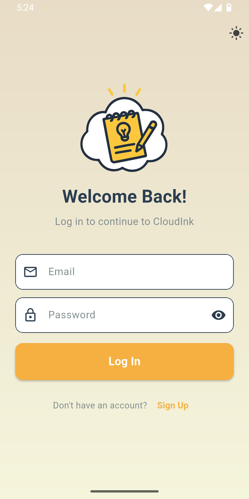</a>
  <a href="screenshots/login_dark.png"></a>
</p>
<p align="center">
  <a href="screenshots/signup_light.png">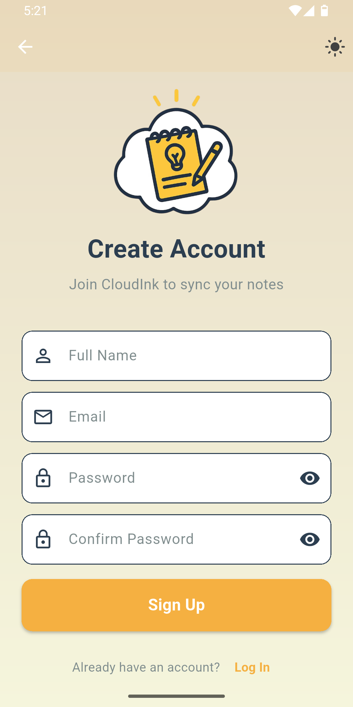</a>
  <a href="screenshots/signup_dark.png">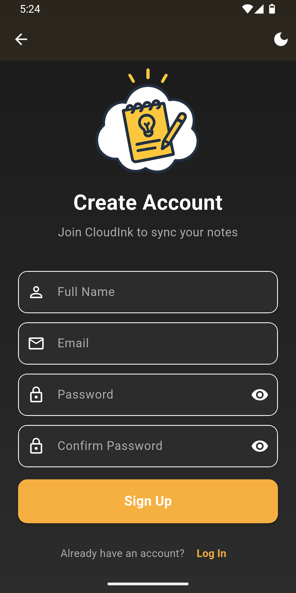</a>
</p>

### Home Screen - Notes & Folders

<p align="center">
  <a href="screenshots/notes_light.png"></a>
  <a href="screenshots/notes_dark.png">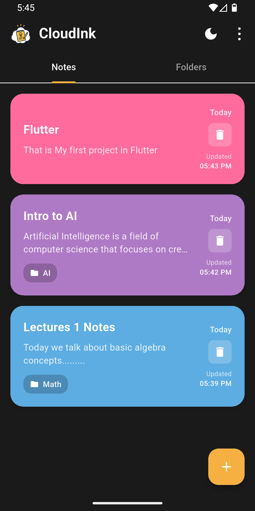</a>
  <a href="screenshots/folders_light.png">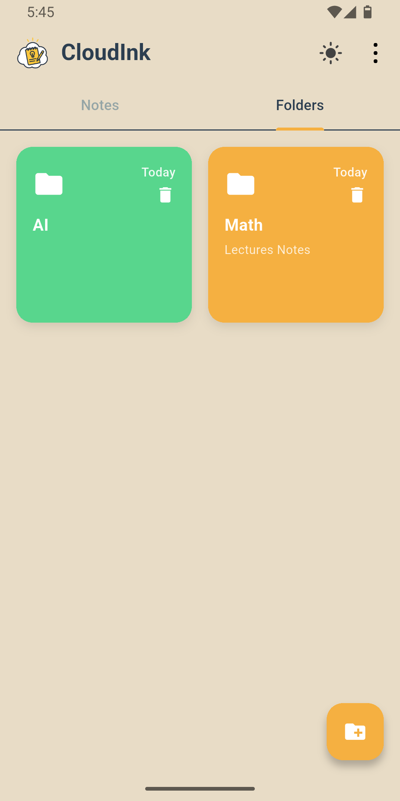</a>
  <a href="screenshots/folders_dark.png">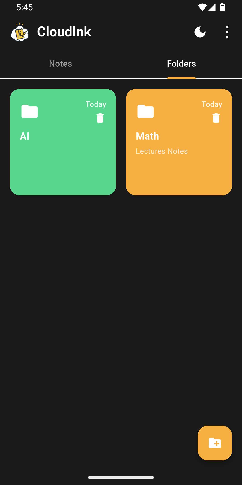</a>
</p>

### Folder Details & Dialogs

<p align="center">
  <a href="screenshots/folder_detail_light.png">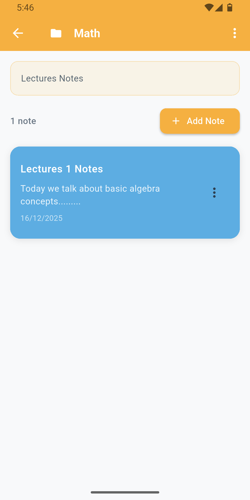</a>
  <a href="screenshots/folder_detail_dark.png">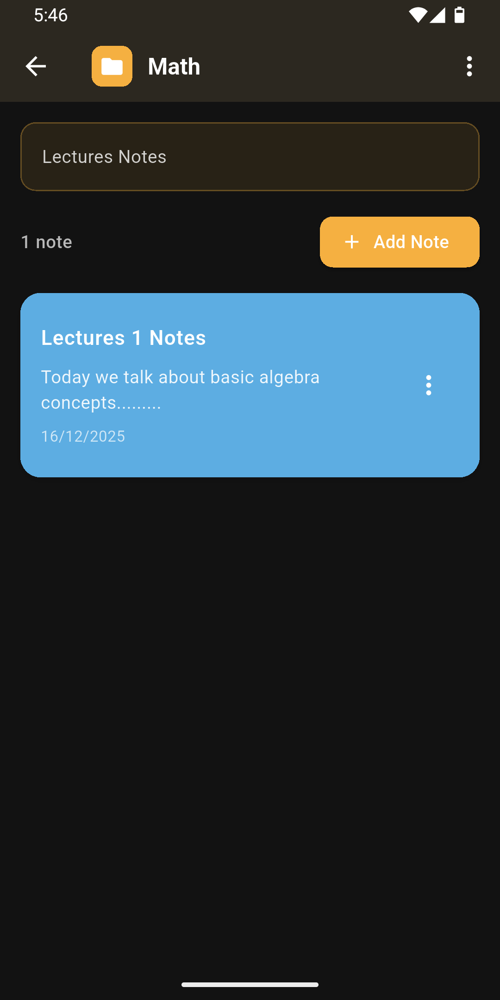</a>
  <a href="screenshots/delete_light.png">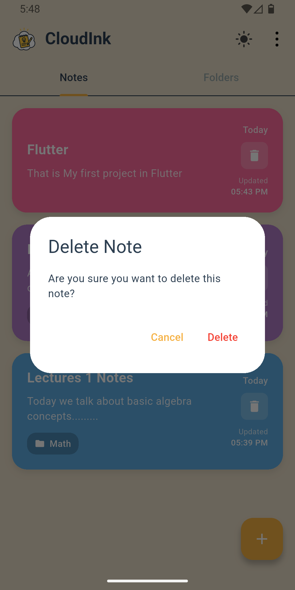</a>
  <a href="screenshots/delete_dark.png">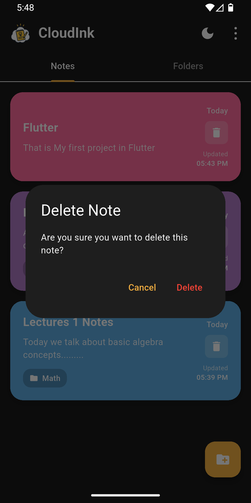</a>
</p>

<p align="center">
  <a href="screenshots/logout_light.png"></a>
  <a href="screenshots/logout_dark.png">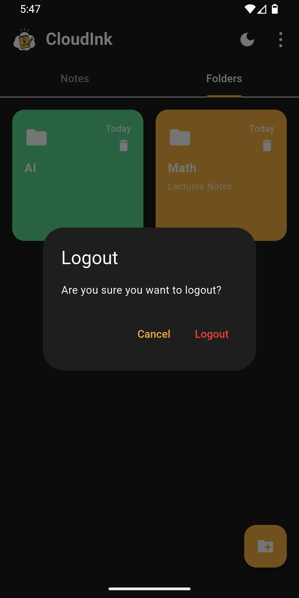</a>
</p>

## 🛠️ Technology Stack

- **Flutter** - Cross-platform mobile development framework
- **Dart** - Programming language
- **Firebase** - Backend and Authentication
- **SharedPreferences** - Local data caching
- **Provider** - State management
- **UUID** - Unique identifier generation
- **Intl** - Date formatting

## 📦 Dependencies

```yaml
dependencies:
  flutter:
    sdk: flutter
  cupertino_icons: ^1.0.8
  shared_preferences: ^2.0.15
  uuid: ^3.0.7
  intl: ^0.19.0
  provider: ^6.0.0
  firebase_core: latest
  firebase_auth: latest
  cloud_firestore: latest
```

## Getting Started 🚀

1. **Clone the repository**
   ```bash
   git clone <repository-url>
   cd CloudInk
   ```

2. **Install dependencies**
   ```bash
   flutter pub get
   ```

3. **Run the app**
   ```bash
   flutter run
   ```

## 📁 App Structure

```
lib/
├── main.dart                      # App entry point
├── models/
│   ├── note.dart                  # Note data model
│   └── folder.dart                # Folder data model
├── screens/
│   ├── login_screen.dart          # User login interface
│   ├── signup_screen.dart         # User registration interface
│   ├── home_screen.dart           # Main notes & folders display
│   ├── add_note_screen.dart       # Note creation/editing
│   ├── add_folder_screen.dart     # Folder creation
│   └── folder_detail_screen.dart  # Folder contents view
├── services/
│   ├── auth_provider.dart         # Authentication management
│   ├── notes_service.dart         # Notes data management
│   ├── notes_provider.dart        # Notes state management
│   ├── folder_service.dart        # Folders data management
│   ├── folders_provider.dart      # Folders state management
│   └── theme_provider.dart        # Theme management (Light/Dark)
└── widgets/
    └── theme_switcher.dart        # Theme toggle widget
```

## 🔍 Features in Detail

### 🎨 Theme Support
- **Light Mode** - Clean beige/cream background with dark text
- **Dark Mode** - Elegant dark gray background with light text
- Smooth theme switching with persistent preference
- Consistent color scheme across both themes

### 🔐 Authentication
- Email/password validation
- Firebase Authentication integration
- Persistent login state
- Secure logout with confirmation dialog

### 📝 Note Management
- Create notes with titles and descriptions
- Choose from colorful note cards (Pink, Purple, Blue, Green)
- Edit existing notes by tapping on them
- Delete notes with confirmation dialog
- Automatic date tracking
- Assign notes to folders

### 📁 Folder Organization
- Create custom folders with colors
- Add descriptions to folders
- View notes within each folder
- Easy folder management

### 💾 Data Storage
- Cloud sync with Firebase Firestore
- Local caching with SharedPreferences
- Real-time data synchronization
- Persistent data across devices

## 🎨 Design Principles

- **Material Design 3** - Following Google's latest design guidelines
- **Adaptive Theming** - Seamless light and dark mode support
- **Color Consistency** - Cohesive color scheme with accent colors
- **User Experience** - Intuitive navigation and interactions
- **Accessibility** - Clear text and appropriate contrast ratios

## 🌈 Color Scheme

### Light Theme
| Element | Color |
|---------|-------|
| Background | `#F5F5DC` (Beige) |
| Card Background | `#FFFFFF` |
| Primary Accent | `#F5B041` (Orange) |
| Text Primary | `#2C3E50` |

### Dark Theme
| Element | Color |
|---------|-------|
| Background | `#1E1E1E` (Dark Gray) |
| Card Background | `#2D2D2D` |
| Primary Accent | `#F5B041` (Orange) |
| Text Primary | `#FFFFFF` |

### Note Colors
| Color | Light | Dark |
|-------|-------|------|
| Pink | `#F48FB1` | `#C2185B` |
| Purple | `#CE93D8` | `#7B1FA2` |
| Blue | `#81D4FA` | `#1976D2` |
| Green | `#A5D6A7` | `#388E3C` |

## 🔮 Future Enhancements

- [ ] Rich text editing with formatting
- [ ] Note categories and tags
- [ ] Search functionality
- [ ] Export/Import features
- [ ] Reminder notifications
- [ ] Share notes feature
- [ ] Note pinning
- [ ] Archive functionality

## 🤝 Contributing

Contributions are welcome! Please feel free to submit a Pull Request.

1. Fork the repository
2. Create your feature branch (`git checkout -b feature/AmazingFeature`)
3. Commit your changes (`git commit -m 'Add some AmazingFeature'`)
4. Push to the branch (`git push origin feature/AmazingFeature`)
5. Open a Pull Request

## 📄 License

This project is licensed under the MIT License - see the [LICENSE](LICENSE) file for details.

## 👨‍💻 Developer

**Shawky Mohamed**

- GitHub: [@ShawkyMohamed2004](https://github.com/ShawkyMohamed2004)

---

<p align="center">
  <strong>CloudInk</strong> - Your Ideas, Everywhere ☁️✨
</p>

<p align="center">
  Made with ❤️ using Flutter
</p>
